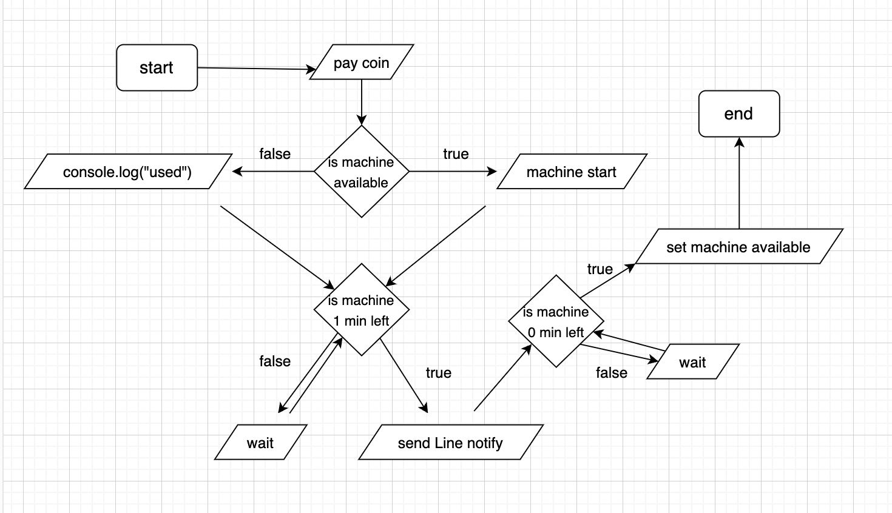

# Washy the Washing Machine
by Nawakoon Peerarasee

## Install to local
```
yarn
npm install
npm start
```
then set your LINE_TOKEN in notify.js or create your own .env file
___
## Run the App
```
node backend/startApp.js
node backend/RESTless-API/runLineNotify.js
```
___

## Paying stimulate

1. machine1
2. machine2
2. machine3
2. machine4
```
node backend/m1coined.js
node backend/m2coined.js
node backend/m3coined.js
node backend/m4coined.js
```
___

Flow chart

